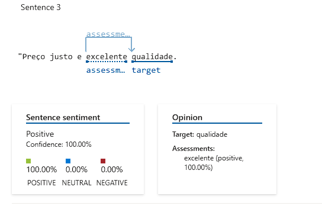
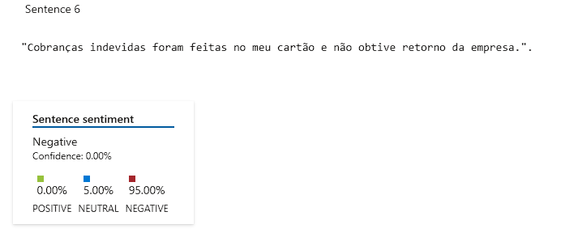
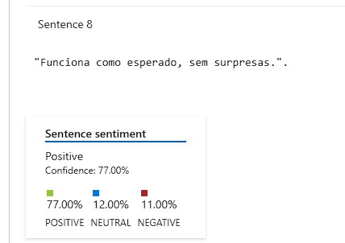

## Análise de Sentimentos com Azure Language Studio

Após estudar o conteúdo e realizar a análise de sentimentos utilizando a IA, percebi a notável capacidade do Azure Language Studio nessa tarefa. Ele avaliou de maneira extremamente satisfatória as sentenças de review que enviei, incluindo aquelas com construções mais ambíguas.
)
)
)
